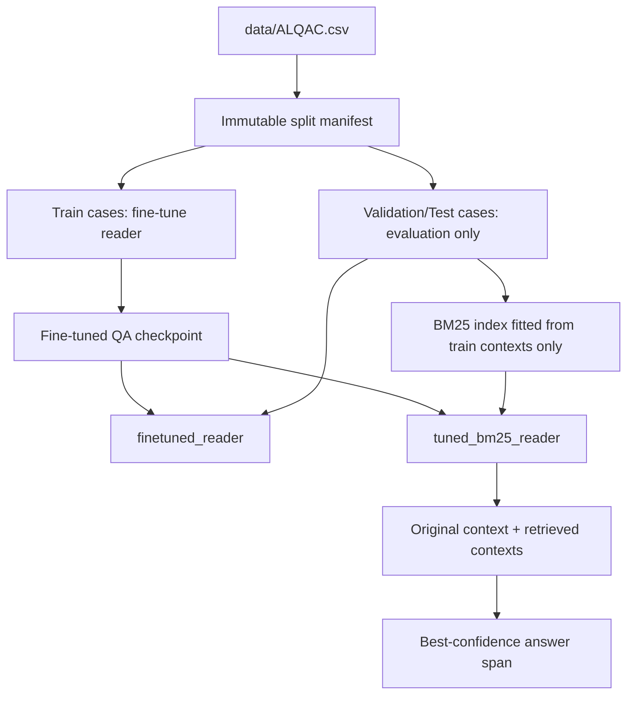

# Hướng dẫn xây dựng và benchmark `finetuned_reader` / `tuned_bm25_reader`

## 1. Mục đích

Tài liệu này mô tả cách xây dựng, kiểm tra provenance và benchmark hai reader baseline của Phase 1:

| Method | Ý nghĩa |
|---|---|
| `finetuned_reader` | Reader extractive QA được fine-tune trên ALQAC/ViLQA train split, chạy trực tiếp trên `case.context`. |
| `tuned_bm25_reader` | Cùng reader fine-tuned, nhưng trước đó dùng BM25 để lấy các context liên quan từ **train cases**, sau đó chạy reader trên context gốc và các context được retrieve. |

Hai method không dùng hai model khác nhau. Chúng dùng chung `finetuned_reader_path`; biến được so sánh là việc thêm retrieval BM25.



## 2. Cấu trúc hiện tại trong code

Hiện tại repository chưa có hai file YAML riêng tên `finetuned_reader.yaml` và `tuned_bm25_reader.yaml`. Hai cấu hình được biểu diễn qua:

1. `--method finetuned_reader` hoặc `--method tuned_bm25_reader`.
2. Các field reader dùng chung trong `BatchRunConfig`:
   - `finetuned_reader_path`
   - `reader_max_seq_length`
   - `reader_doc_stride`
   - `reader_max_answer_length`
3. Các field retrieval dùng cho `tuned_bm25_reader`:
   - `retrieval_method`
   - `evidence_top_k`
   - `retrieval_rough_top_n`
   - `retrieval_reranker_model` nếu dùng `bm25_rerank`.

Các điểm code chính:

| Thành phần | File | Vai trò |
|---|---|---|
| Training config | `src/reader/finetune_reader.py` | `ReaderConfig`, tokenizer, Trainer, checkpoint metadata |
| Training CLI | `scripts/train_reader.py` | Đọc manifest, train reader và ghi `checkpoint_manifest.json` |
| Reader inference | `src/reader/finetune_reader.py` | `LegalQAReader.predict()` và `predict_with_retrieved_context()` |
| Baseline dispatch | `src/experiment_runner.py` | `_run_finetuned_reader()` và `_run_tuned_bm25_reader()` |
| Reader baseline logic | `src/baselines.py` | `finetuned_reader_prediction()` và `tuned_bm25_reader_prediction()` |
| Retrieval | `src/retrieval/legal_retriever.py` | BM25 index trên train contexts |
| CLI resolver | `src/main.py` | Đọc `baselines.finetuned_reader` và các field retrieval |

## 3. YAML structure được sử dụng

Trong YAML hiện tại, reader path và các tham số reader được đặt dưới `baselines.finetuned_reader`. Cả hai method đều dùng block này:

```yaml
baselines:
  extractive_qa:
    model: deepset/xlm-roberta-base-squad2

  finetuned_reader:
    model_path: checkpoints/legal_qa_reader/best_model
    max_seq_length: 384
    doc_stride: 128
    max_answer_length: 50

retrieval:
  legal_evidence_top_k: 5
  past_memory_top_k: 5
  rough_top_n: 100
  method: bm25_only
  reranker_model: BAAI/bge-m3
```

Ý nghĩa theo method:

```text
finetuned_reader:
    reader = checkpoint(model_path)
    answer = reader.predict(question, original_context)

tuned_bm25_reader:
    retriever = LegalRetriever(train_cases, method=retrieval.method)
    retrieved = retriever.retrieve(question + original_context, top_k=legal_evidence_top_k)
    answer = reader.predict_with_retrieved_context(
        question,
        original_context,
        retrieved_contexts=retrieved,
    )
```

Lưu ý: resolver hiện tại chỉ đọc reader block `baselines.finetuned_reader`; không cần lặp lại `model_path` trong block `baselines.tuned_bm25_reader`. Nếu muốn tạo YAML độc lập cho `tuned_bm25_reader`, cần mở rộng `resolve_reader_settings()` và `BatchRunConfig`, không nên chỉ thêm key YAML mà không thêm code resolver.

## 4. Data contract và chống leakage

### 4.1 Dataset

Input chính là `data/ALQAC.csv` với ba cột bắt buộc:

```text
context, question, answer
```

Case ID được chuẩn hóa thành `vilqa-<row_index>`.

### 4.2 Split bắt buộc

Dùng manifest bất biến:

```text
data/splits/alqac_v1.json
```

Split hiện tại:

| Split | Số case | Mục đích |
|---|---:|---|
| train | 424 | Fine-tune model và fit BM25 index |
| validation | 53 | Early stopping, chọn checkpoint và báo cáo validation |
| test | 53 | Chỉ đánh giá cuối cùng; không được dùng trong training/tuning |

Manifest kiểm tra cả SHA256 của dataset. Không tự ý tạo lại manifest giữa các lần chạy nếu chưa review thay đổi.

### 4.3 Reader training data

`LegalQADataset` chuyển mỗi case sang SQuAD2 format:

- `context` giữ nguyên văn bản pháp lý.
- `question` là câu hỏi.
- `answer` được tìm bằng exact substring trong `context`.
- `answer_start` là vị trí ký tự đầu tiên.
- Nếu answer không xuất hiện nguyên văn trong context, case được đánh dấu `is_impossible=True`.
- Test split bị từ chối ở constructor của `LegalQADataset`.

Điểm cần audit trước khi train:

1. Bao nhiêu answer không tìm thấy trong context.
2. Answer có nhiều lần xuất hiện hay không; code hiện chọn lần xuất hiện đầu tiên.
3. Những case có answer chuẩn hóa khác với substring trong context.
4. Không đưa `answer` của validation/test vào retrieval index hoặc prompt inference.

### 4.4 Retrieval index

`LegalRetriever.from_cases(train_cases)` chỉ index context của train cases. Với `tuned_bm25_reader`, query được lấy từ `case.retrieval_query`; kết quả được giới hạn bởi `evidence_top_k`.

Không được:

- Fit BM25 trên toàn bộ dataset trước khi split.
- Index validation/test context để cải thiện retrieval.
- Dùng answer/gold label làm field retrieve.
- Bật `update_memory` trên validation/test trong một run sạch.

## 5. Chuẩn bị môi trường

Chạy từ repository root `D:\Research`.

```powershell
pip install -U pip
pip install "torch>=2.0.0" "transformers>=4.36.0,<5.0.0" `
  "accelerate>=0.21.0" "datasets>=2.14.0" "sentencepiece>=0.1.99"
```

Kiểm tra dependency:

```powershell
python scripts/verify_reader_deps.py
```

Các package tối thiểu được code kiểm tra:

- PyTorch `>=2.0.0`
- Transformers `>=4.36.0,<5.0.0`
- Accelerate `>=0.21.0`
- SentencePiece `>=0.1.99`

Nếu dùng GPU, có thể bật `--fp16`. Nếu không có CUDA, code tự chuyển về FP32.

## 6. Xây dựng checkpoint `finetuned_reader`

### 6.1 Kiểm tra manifest trước khi train

```powershell
Test-Path data/splits/alqac_v1.json
Get-Content data/splits/alqac_v1.json | Select-String '"counts"|"dataset_sha256"'
```

Chỉ tạo manifest mới khi dataset hoặc split strategy thực sự thay đổi và đã được review:

```powershell
python scripts/create_split_manifest.py `
  --config configs/default.yaml `
  --output data/splits/alqac_v1.json
```

### 6.2 Lệnh train reproducible

Ví dụ cấu hình 5 epochs, tương thích với reader result lịch sử:

```powershell
python scripts/train_reader.py `
  --config configs/default.yaml `
  --dataset data/ALQAC.csv `
  --split-manifest data/splits/alqac_v1.json `
  --base-model deepset/xlm-roberta-base-squad2 `
  --output-dir checkpoints/legal_qa_reader `
  --learning-rate 3e-5 `
  --epochs 5 `
  --batch-size 8 `
  --eval-batch-size 8 `
  --max-seq-length 384 `
  --doc-stride 128 `
  --warmup-steps 100 `
  --weight-decay 0.01 `
  --num-workers 0
```

Giá trị mặc định trong `ReaderConfig` là 3 epochs. Nếu thay đổi epochs, learning rate, batch size hoặc max sequence length, phải ghi lại trong checkpoint manifest và không so sánh trực tiếp với checkpoint cũ như thể cùng cấu hình.

### 6.3 Pipeline bên trong

`finetune_reader()` thực hiện:

1. Kiểm tra dependency và CUDA.
2. Chuyển train/validation cases sang SQuAD2 JSON.
3. Ghi `train_squad.json` và `val_squad.json` vào output directory.
4. Load tokenizer và `AutoModelForQuestionAnswering` từ `base_model`.
5. Tokenize context theo `max_seq_length=384`, `doc_stride=128`.
6. Fine-tune bằng Hugging Face `Trainer`.
7. Evaluate theo step trên validation features.
8. Load best model nếu `load_best_model_at_end=True`.
9. Ghi model/tokenizer vào `best_model/`.
10. Ghi `training_metadata.json`.

Training metadata cần ghi lại ít nhất:

```json
{
  "base_model": "deepset/xlm-roberta-base-squad2",
  "num_train_cases": 424,
  "num_val_cases": 53,
  "config": {
    "max_seq_length": 384,
    "doc_stride": 128,
    "learning_rate": 0.00003,
    "num_train_epochs": 5,
    "per_device_train_batch_size": 8,
    "warmup_steps": 100,
    "weight_decay": 0.01,
    "seed": 42
  }
}
```

Sau khi training, `scripts/train_reader.py` ghi thêm:

```text
checkpoints/legal_qa_reader/best_model/checkpoint_manifest.json
```

Manifest checkpoint phải có:

- `base_model`
- `dataset_sha256`
- `train_validation_manifest_hash`
- `train_case_ids`
- `validation_case_ids`
- `hyperparameters`
- package versions
- `checkpoint_hash`

Không xóa `checkpoint_manifest.json`. Runner sẽ từ chối chạy nếu manifest bị thiếu hoặc không có `train_case_ids`.

## 7. Chạy riêng `finetuned_reader`

Reader không gọi LLM để sinh answer, nhưng `BaselineBatchRunner` bỏ qua reader methods khi `llm_backend=mock`. Vì vậy không dùng `--llm mock` cho benchmark reader.

Lệnh validation sạch, không retrieval:

```powershell
python -m src.main `
  --config configs/default.yaml `
  --run-batch `
  --llm local `
  --local-model qwen3.5:9b `
  --split validation `
  --method finetuned_reader `
  --limit 0 `
  --finetuned-reader-path checkpoints/legal_qa_reader/best_model `
  --reader-max-seq-length 384 `
  --reader-doc-stride 128 `
  --reader-max-answer-length 50 `
  --retrieval-method off `
  --memory-mode off
```

`--llm local` ở đây chỉ để không kích hoạt nhánh skip dành cho MockLLM; method reader không sử dụng endpoint LLM trong lúc dự đoán.

Luồng xử lý mỗi case:

```python
reader.predict(
    question=case.question,
    context=case.context,
)
```

Đầu ra là span extractive có `answer`, `score`, `start_index`, `end_index`. Evaluation dùng `ViLQAEvaluator` để tính Exact Match và token F1.

## 8. Xây dựng `tuned_bm25_reader`

### 8.1 Khác biệt so với `finetuned_reader`

`tuned_bm25_reader` dùng cùng checkpoint nhưng thêm retrieval:

```python
retrieved = retriever.retrieve(
    case.retrieval_query,
    top_k=config.evidence_top_k,
)

result = reader.predict_with_retrieved_context(
    question=case.question,
    context=case.context,
    retrieved_contexts=[document.text for document in retrieved],
    top_k_answers=5,
)
```

Reader chạy trên:

1. Context gốc của case.
2. Từng retrieved context.
3. Chọn answer span có confidence cao nhất.

Nếu không có answer hợp lệ từ retrieved contexts, code fallback về `reader.predict()` trên context gốc.

### 8.2 Cấu hình BM25 khuyến nghị

```yaml
retrieval:
  method: bm25_only
  legal_evidence_top_k: 5
  rough_top_n: 100
  reranker_model: BAAI/bge-m3

baselines:
  finetuned_reader:
    model_path: checkpoints/legal_qa_reader/best_model
    max_seq_length: 384
    doc_stride: 128
    max_answer_length: 50
```

`rough_top_n` chỉ có ý nghĩa ở bước BM25 candidate retrieval. Với `bm25_rerank`, top candidates được rerank bằng `BAAI/bge-m3`; đây là một ablation khác, không nên gọi là cùng cấu hình BM25-only.

### 8.3 Lệnh chạy

```powershell
python -m src.main `
  --config configs/default.yaml `
  --run-batch `
  --llm local `
  --local-model qwen3.5:9b `
  --split validation `
  --method tuned_bm25_reader `
  --limit 0 `
  --finetuned-reader-path checkpoints/legal_qa_reader/best_model `
  --reader-max-seq-length 384 `
  --reader-doc-stride 128 `
  --reader-max-answer-length 50 `
  --retrieval-method bm25_only `
  --evidence-top-k 5 `
  --retrieval-rough-top-n 100 `
  --memory-mode off
```

Để kiểm tra tác động của semantic reranking:

```powershell
python -m src.main `
  --config configs/default.yaml `
  --run-batch `
  --llm local `
  --local-model qwen3.5:9b `
  --split validation `
  --method tuned_bm25_reader `
  --limit 0 `
  --finetuned-reader-path checkpoints/legal_qa_reader/best_model `
  --retrieval-method bm25_rerank `
  --evidence-top-k 5 `
  --retrieval-rough-top-n 100 `
  --retrieval-reranker-model BAAI/bge-m3 `
  --memory-mode off
```

## 9. `finetuned_reader` và `tuned_bm25_reader` không nên bị nhầm với nhau

| Khía cạnh | `finetuned_reader` | `tuned_bm25_reader` |
|---|---|---|
| Checkpoint | Cùng `best_model` | Cùng `best_model` |
| Input reader | Context gốc | Context gốc + retrieved contexts |
| BM25 index | Không dùng trong answer path | Fit từ train contexts |
| `retrieval_method` | Nên đặt `off` | `bm25_only` hoặc `bm25_rerank` |
| `evidence_top_k` | Không ảnh hưởng kết quả | Ảnh hưởng trực tiếp |
| Chi phí inference | Một lần reader/case | Nhiều lần reader/case |
| Rủi ro chính | Span boundary, answer không xuất hiện nguyên văn | Retrieval noise, context cạnh tranh, confidence chọn nhầm |
| Câu hỏi nghiên cứu | Giá trị của fine-tuned reader | BM25 có giúp reader hay làm giảm chất lượng? |

Không được dùng hai checkpoint khác nhau khi so sánh hai method; nếu làm vậy sẽ trộn lẫn tác động của fine-tuning và retrieval.

## 10. Artifact sau mỗi batch run

Mỗi run hợp lệ cần có:

```text
outputs/<group>/<timestamp>_validation_<method>/
├── predictions.csv
├── metrics.json
├── config.json
└── run_manifest.json
```

### `predictions.csv`

Kiểm tra:

- Đủ một prediction cho mỗi case.
- `case_id` không trùng.
- `method` đúng với method đang chạy.
- `predicted_answer` không rỗng.
- Không có validation/test answer được đưa vào input reader ngoài mục đích evaluation.

### `metrics.json`

Các field quan trọng:

```json
{
  "split": "validation",
  "method": "finetuned_reader",
  "num_cases": 53,
  "metrics_by_method": {
    "finetuned_reader": {
      "num_predictions": 53,
      "exact_match": 0.0,
      "f1": 0.0
    }
  },
  "models_by_method": {
    "finetuned_reader": {
      "model": "checkpoints/legal_qa_reader/best_model"
    }
  }
}
```

### `config.json`

Phải snapshot các field sau:

- `finetuned_reader_path`
- `reader_max_seq_length`
- `reader_doc_stride`
- `reader_max_answer_length`
- `retrieval_method`
- `retrieval_rough_top_n`
- `retrieval_reranker_model`
- `evidence_top_k`
- `dataset_sha256`
- `split_manifest_hash`
- `memory_snapshot_hash`
- `contaminated`

### `run_manifest.json`

Dùng để kiểm tra provenance dataset, split và memory. Với run nghiên cứu, `contaminated` phải là `false`.

## 11. Lệnh evaluation checkpoint riêng

Sau training, chạy validation reader trực tiếp:

```powershell
python scripts/train_reader.py `
  --eval-only `
  --config configs/default.yaml `
  --dataset data/ALQAC.csv `
  --split-manifest data/splits/alqac_v1.json `
  --model-path checkpoints/legal_qa_reader/best_model
```

Kết quả được ghi tại:

```text
checkpoints/legal_qa_reader/best_model/eval_results.json
```

Đây là evaluation chỉ của `finetuned_reader`. Muốn đánh giá `tuned_bm25_reader`, phải chạy batch runner vì method này cần khởi tạo train-only BM25 retriever.

## 12. Sanity checks và test

Chạy unit tests trước khi benchmark:

```powershell
python -m unittest discover -s tests
```

Các test reader hiện có kiểm tra:

- Chuyển answer span sang SQuAD2 dictionary.
- Xử lý impossible answer.
- Tương thích `TrainingArguments` giữa các phiên bản Transformers.
- Kiểm tra dependency.
- Tokenization và `start_positions`/`end_positions`.
- Reader checkpoint không được overlap với evaluation cases.

Kiểm tra checkpoint trước batch run:

```powershell
$checkpoint = "checkpoints/legal_qa_reader/best_model"
Test-Path "$checkpoint/config.json"
Test-Path "$checkpoint/tokenizer_config.json"
Test-Path "$checkpoint/checkpoint_manifest.json"
Get-Content "$checkpoint/checkpoint_manifest.json" | Select-String 'dataset_sha256|train_case_ids|validation_case_ids'
```

Nếu thiếu `checkpoint_manifest.json`, không bypass bằng cách tạo file rỗng. Hãy train lại checkpoint hoặc khôi phục manifest chính xác từ run gốc.

## 13. Kết quả tham chiếu hiện có

Các điểm sau là historical benchmark, dùng để đối chiếu sau khi rebuild; không được xem là kết quả mới nếu chưa chạy lại với checkpoint và manifest hiện tại:

| Split | Method | EM | F1 | Ghi chú |
|---|---|---:|---:|---|
| validation 130 | `finetuned_reader` | **0.4846** | 0.7134 | Full validation |
| validation 130 | `tuned_bm25_reader` | 0.3615 | 0.5992 | BM25 làm giảm chất lượng reader |
| validation 53 | `finetuned_reader` | **0.5849** | 0.7610 | Historical subset |
| validation 53 | `tuned_bm25_reader` | 0.5283 | 0.7023 | Historical subset |

Diễn giải thận trọng: trong các record hiện tại, thêm BM25 không cho thấy cải thiện so với reader fine-tuned chạy trực tiếp. Đây là kết quả dưới các cấu hình đã ghi, không phải kết luận rằng BM25 luôn làm giảm hiệu năng trên mọi retriever hoặc checkpoint.

## 14. Vấn đề hiện tại cần xử lý trước khi công bố kết quả mới

Tại thời điểm viết tài liệu, workspace không có:

```text
checkpoints/legal_qa_reader/best_model/
```

Do đó `finetuned_reader` và `tuned_bm25_reader` chưa thể chạy lại một cách hợp lệ; `BaselineBatchRunner` sẽ dừng vì thiếu `checkpoint_manifest.json`. Cần rebuild checkpoint bằng `scripts/train_reader.py`, sau đó chạy cả hai method trên cùng một validation/test manifest.

Quy trình công bố nên dùng:

1. Train một checkpoint duy nhất trên train=424.
2. Dùng validation=53 để kiểm tra và chọn cấu hình training.
3. Giữ nguyên checkpoint khi chạy cả hai method.
4. Fit BM25 chỉ từ train contexts.
5. Chạy `finetuned_reader` với retrieval off.
6. Chạy `tuned_bm25_reader` với BM25-only.
7. Báo cáo cùng evaluation code, cùng split, cùng checkpoint và đầy đủ artifact.
8. Chỉ chạy test sau khi khóa reader config và retrieval config.

