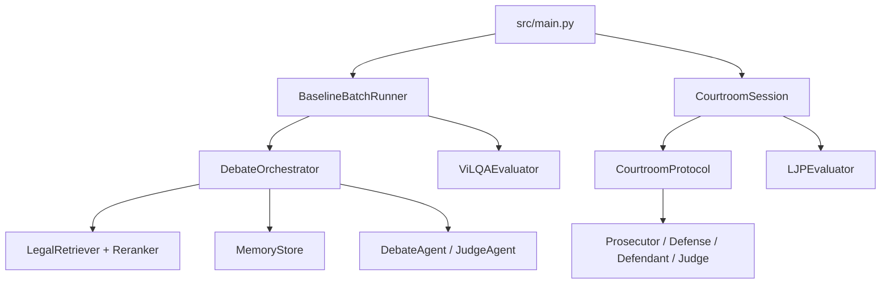

# Multi-Agent Courtroom Simulation — Tình Trạng & Mô Tả Dự Án

> Cập nhật: 2026-06-17  
> Liên quan: [Phân tích kỹ thuật](./advanced-techniques-analysis.md) · [Checklist triển khai](./implementation-checklist.md)

---

## 1. Tóm tắt dự án

**Multi-Agent Courtroom Simulation Framework** là dự án nghiên cứu AI/NLP tập trung vào:

- Giả lập tranh tụng pháp lý đa tác tử (Proponent/Opponent hoặc Prosecutor/Defense/Defendant/Judge).
- Dự đoán câu trả lời pháp lý ngắn (ViLQA/ALQAC extractive QA) ở Phase 1.
- Mở rộng sang **Legal Judgment Prediction (LJP)** với protocol phiên tòa có cấu trúc ở Phase 3.

Ngôn ngữ ưu tiên: **tiếng Việt** (ALQAC, UTS_VLC, pilot case hình sự VN). Hỗ trợ mở rộng EN qua SimuCourt/VLegal-Bench.

### Câu hỏi nghiên cứu chính

1. Debate đa tác tử có cải thiện độ chính xác legal QA/LJP so với single-agent (Direct, CoT) không?
2. Retrieval (BM25 + rerank) và memory 3 tầng có giúp grounding bằng chứng/pháp luật không?
3. Protocol phiên tòa có cấu trúc có tạo lập luận khách quan và giảm hallucination hơn vanilla debate không?

---

## 2. Kiến trúc tổng thể

### 2.1 Pipeline Phase 1 (ViLQA QA Debate)

```text
Input (context + question)
    ↓
Retrieve legal evidence     [BM25 ± semantic rerank ± UTS_VLC]
    ↓
Retrieve past memory        [regulations / experiences / cases]
    ↓
Debate loop (n rounds)
    Proponent → Opponent → Judge (belief update)
    [optional: judge question, early stop, closing statements]
    ↓
Judge verdict (JSON)
    ↓
Evaluator                   [EM/F1 + optional LLM rubric]
    ↓
Update memory               [reflection, mode read_update]
```

### 2.2 Pipeline Phase 3 (Courtroom LJP)

```text
CourtCase (facts, evidence, testimonies, ground_truth)
    ↓
Opening: Judge → Prosecutor indictment → Defendant testimony → Defense opening
    ↓
Debate (n rounds): Prosecutor ↔ Defense [± Judge question]
    ↓
Closing: Prosecutor → Defense
    ↓
Judgment: Judge deliberation → LJP verdict (charge/article/sentence)
    ↓
LJPEvaluator
```

### 2.3 Sơ đồ module



---

## 3. Cấu trúc repository

| Thư mục / file | Vai trò |
|---|---|
| `src/main.py` | CLI: smoke test, batch P1, courtroom pilot |
| `src/models.py` | Schema Pydantic: CaseProfile, CourtCase, DebateResult, LegalJudgment, … |
| `src/data_loader.py` | ALQAC CSV, court JSON, SimuCourt, VLegal-Bench |
| `src/llm.py` | LLMClient, MockLLM, GeminiLLM, OpenAILLM, LocalLLM, factory theo role |
| `src/orchestrator.py` | DebateOrchestrator Phase 1 |
| `src/experiment_runner.py` | Batch runner, baselines, ablation config |
| `src/baselines.py` | Direct, CoT, Vanilla, extractive QA, BM25+reader |
| `src/retrieval/` | BM25 retriever, semantic reranker, UTS_VLC loader |
| `src/memory/memory_store.py` | Memory 3 tầng, reflection, dedup |
| `src/agents/` | DebateAgent, JudgeAgent, EvaluatorAgent, prosecutor/defense/defendant |
| `src/courtroom/` | Protocol + Session Phase 3 |
| `src/evaluation/` | ViLQAEvaluator, LJPEvaluator |
| `src/utils/` | answer_postprocess, prompt_compact |
| `configs/default.yaml` | Cấu hình P1: dataset, retrieval, memory, LLM roles |
| `configs/courtroom.yaml` | Cấu hình Phase 3 protocol |
| `configs/prompts/` | Prompt Phase 1 + `courtroom/` |
| `data/ALQAC.csv` | Dataset ViLQA chính Phase 1 |
| `data/processed/case_01_theft.json` | Pilot case trộm cắp VN |
| `scripts/run_ablation_matrix.py` | Sinh/chạy ma trận ablation P1 |
| `scripts/error_analysis.py` | Phân tích lỗi dự đoán |
| `tests/` | 31 unit tests (mock/offline) |
| `docs/` | Tài liệu dự án và kế hoạch thí nghiệm |
| `memory-bank/` | Ngữ cảnh dự án cho agent (brief, progress, patterns) |

---

## 4. Phases và phạm vi

| Phase | Mục tiêu | Task chính | Trạng thái |
|---|---|---|---|
| **Phase 1** | ViLQA extractive QA qua structured debate | Pipeline đầy đủ + baselines + batch + ablation | **Đã implement**; đang validation LLM thật |
| **Phase 2** | Memory & RAG nâng cao | UTS_VLC, rerank, memory ablation, similar-case | **Một phần** (code có, chưa ablation đầy đủ) |
| **Phase 3** | Courtroom LJP simulation | Roles pháp lý, protocol 3 giai đoạn, LJP metrics | **Scaffold xong**; chưa batch runner |
| **Phase 4** | Đánh giá & an toàn | Citation check, hallucination, human eval, LegalSim red-team | **Chưa bắt đầu** |

---

## 5. Các phần đã đạt được

### 5.1 Hạ tầng & reproducibility

- [x] Loader ViLQA/ALQAC với split cố định (seed 42: train 424 / val 53 / test 53).
- [x] Schema Pydantic thống nhất cho toàn pipeline.
- [x] `CaseProfile.agent_view()` loại gold answer — chống data leakage.
- [x] LLM factory đa provider: `mock`, `gemini`, `openai`, `local` (Ollama-compatible).
- [x] Config theo role (direct, cot, proponent, opponent, judge, evaluator, prosecutor, …).
- [x] Batch artifacts: `predictions.csv`, `metrics.json`, `config.json` (không lưu API key).
- [x] **31 unit tests** pass offline (`python -m unittest discover -s tests`).

### 5.2 Phase 1 — Debate QA

- [x] `DebateAgent`: private strategy → public argument/rebuttal.
- [x] `JudgeAgent`: belief tracking, verdict JSON, fallback + retry, `fallback_rate` trong metrics.
- [x] `DebateOrchestrator`: n-round loop, closing statements, optional judge question, early stop theo confidence.
- [x] `LegalRetriever`: BM25 lexical trên train contexts.
- [x] `SemanticReranker`: BGE-m3 / lexical fallback.
- [x] UTS_VLC corpus loader (optional, `--include-uts-vlc`).
- [x] `MemoryStore`: 3 bucket, mode off/read_only/read_update, reflection prompt, dedup, embedding retrieval.
- [x] Baselines: Direct LLM, CoT, Vanilla Debate, extractive QA reader, BM25+reader.
- [x] `ViLQAEvaluator`: Exact Match + token F1.
- [x] `EvaluatorAgent`: rubric LLM-as-judge (legal_accuracy, argument_quality, logical_consistency).
- [x] `answer_postprocess.py`: rút span legal ngắn, áp dụng đồng đều mọi method.
- [x] Ablation matrix script + plan (`docs/experiments/p1_ablation_plan.md`).

### 5.3 Phase 3 — Courtroom LJP

- [x] `CourtCase` schema: facts, evidence, testimonies, judgment ground truth.
- [x] Agents: `ProsecutorAgent`, `DefenseAgent`, `DefendantAgent`, `JudgeAgent` (LJP methods).
- [x] `CourtroomProtocol`: opening → debate → closing → deliberation → ruling.
- [x] `CourtroomSession`: lifecycle đầy đủ, early stop, phase logging.
- [x] Pilot case: `data/processed/case_01_theft.json` (tội trộm cắp, BLHS VN).
- [x] `LJPEvaluator`: charge/article accuracy, sentence metrics, citation hooks.
- [x] Loaders: `load_court_case_json`, `load_simucourt`, `load_vlegal` (cần verify HF schema).
- [x] CLI: `--run-courtroom`, `--courtroom-case`, `--courtroom-config`.
- [x] Backward compat Phase 1 qua `src/agents/compat.py`.

### 5.4 Tích hợp LLM thật

- [x] Gemini API (`google-genai` SDK) — smoke test thành công với `gemini-2.5-flash`.
- [x] Local Ollama (qwen3.5:9b, dolphin3) — validation batch đã chạy.
- [x] Role-specific temperature và max_output_tokens trong YAML.

---

## 6. Kết quả thí nghiệm đã ghi nhận

| Thí nghiệm | Model | Split | Kết quả nổi bật | Ghi chú |
|---|---|---|---|---|
| Mock batch | MockLLM | validation | EM/F1 thấp, orchestration OK | Không phải baseline thực |
| Direct validation | dolphin3:latest | val 53 | EM=0.264, F1=0.680 | Direct mạnh với model nhỏ |
| Debate validation (trước fix) | dolphin3:latest | val 53 | EM=0.076, F1=0.368 | Over-extraction / paraphrase |
| Debate validation (sau fix) | dolphin3:latest | val 53 | EM=0.170, F1=0.511 | Postprocess + prompt siết span |
| Both (qwen3.5:9b) | qwen3.5:9b | val 53 | **Debate EM=0.472, F1=0.811** vs Direct EM=0.019, F1=0.403 | Debate thắng lớn; direct bị cắt token |
| Gemini smoke | gemini-2.5-flash | 1 case | Verdict đúng "07 năm" | 1 round, pipeline end-to-end OK |
| Courtroom smoke | MockLLM | case_01_theft | Session hoàn tất | Phase 3 kỹ thuật OK |

**Lưu ý khoa học:** Chưa claim chính thức "debate > direct" cho đến khi ablation matrix chạy xong trên cùng config ổn định và test split chạy một lần cuối.

---

## 7. Đang thực hiện

- Error analysis P1 (over-extraction, paraphrase, wrong law span).
- Validation courtroom pilot bằng Gemini/local LLM.
- Mapping field SimuCourt / VLegal-Bench sau khi tải HuggingFace.
- Gemini validation full split + ablation matrix `--execute`.

---

## 8. Chưa hoàn thành

- [ ] Batch courtroom runner + metrics aggregation cho LJP.
- [ ] Ablation matrix P1 chạy đầy đủ với LLM ổn định (Gemini hoặc qwen3.5).
- [ ] Similar-case retrieval (Courtroom-LLM style).
- [ ] Citation validity checker (LegalCiteBench style).
- [ ] Legal hallucination detection (LegalHalBench style).
- [ ] Procedural exploit red-team (LegalSim style).
- [ ] Human evaluation rubric cho courtroom sessions.
- [ ] So sánh Phase 1 vs Phase 3 trên cùng case adapter.
- [ ] Báo cáo paper-ready: bảng ablation, error analysis, case study transcript.

---

## 9. Vấn đề đã biết

| Vấn đề | Ảnh hưởng | Hướng xử lý |
|---|---|---|
| Debate trả span dài / paraphrase EN | EM/F1 thấp với model nhỏ | Prompt + `shorten_legal_answer()` (đã siết; cần re-run) |
| Direct bị cắt JSON khi `max_output_tokens` quá thấp | Direct baseline không công bằng | Bump direct/cot lên 384 tokens; JSON recovery |
| Gemini free tier quota / key leaked | API 429/403 | Key mới; dùng flash-lite hoặc local |
| SimuCourt HF schema có thể khác | Loader fail hoặc mapping sai | Verify sau download |
| MockLLM không phản ánh chất lượng LLM | Smoke only | Luôn dùng LLM thật cho metric claims |
| Courtroom dual verdict (LJP + QA view) | Confusion khi đọc output | Document rõ; QA view là backward-compat |

---

## 10. Lệnh vận hành thường dùng

### Smoke test dữ liệu

```powershell
python -m src.main --dataset data/ALQAC.csv
```

### Debate 1 case (Gemini)

```powershell
$env:GEMINI_API_KEY = [Environment]::GetEnvironmentVariable('GEMINI_API_KEY','User')
python -m src.main --run-debate --llm gemini --gemini-model gemini-2.5-flash --case-index 0 --rounds 1
```

### Batch validation Phase 1

```powershell
python -m src.main --run-batch --split validation --method both --limit 0 --rounds 1 --llm local
```

### Courtroom pilot (mock)

```powershell
python -m src.main --run-courtroom --llm mock --courtroom-case data/processed/case_01_theft.json
```

### Unit tests

```powershell
python -m unittest discover -s tests -v
```

### Ablation dry-run

```powershell
python scripts/run_ablation_matrix.py --llm mock --limit 5
```

---

## 11. Dataset & tài nguyên liên quan

Chi tiết dataset công khai: [`docs/legal-datasets-collection.md`](./legal-datasets-collection.md).

| Dataset | Vai trò trong dự án |
|---|---|
| `data/ALQAC.csv` | Phase 1 chính — ViLQA extractive QA |
| `VietnamAIHub/UTS_VLC` | External legal corpus cho RAG |
| `data/processed/case_01_theft.json` | Pilot LJP VN |
| SimuCourt / AgentsCourt | Benchmark courtroom (planned) |
| VLegal-Bench | 22 task pháp lý VN (planned) |
| SynthLaw / MASER | Kịch bản tổng hợp (planned) |

---

## 12. Related work đã review

Các paper trong `document/` đã được tóm tắt và map vào thiết kế:

1. AgenticSimLaw — debate explainability, private/public split  
2. AgentsCourt — RAG + court simulation + Agent-as-Judge  
3. Courtroom-LLM — similar-case, structured multi-LLM  
4. AgentCourt Adversarial Evolvable — knowledge evolution 3-tier  
5. MASER — multi-agent legal interaction driver  
6. LegalSim — procedural exploit / AI safety  

Phân tích chi tiết: [`docs/advanced-techniques-analysis.md`](./advanced-techniques-analysis.md).

---

## 13. Tiêu chí hoàn thành theo phase

### Phase 1 — Done khi

- Debate vs baselines có metric validation reproducible (cùng config, cùng code eval).
- Ablation ≥ 6 biến chính đã chạy và ghi `p1_ablation_summary.csv`.
- Error analysis phân loại ≥ 80% lỗi debate.
- Test split chạy **một lần** sau khi chốt hyperparameter trên validation.

### Phase 3 — Done khi

- ≥ 1 courtroom session LLM thật hoàn chỉnh 3 giai đoạn trên pilot VN.
- LJP metrics trên pilot + ≥ 1 sample external dataset.
- Batch runner courtroom tương đương `BaselineBatchRunner`.

---

## 14. Liên kết tài liệu

| File | Nội dung |
|---|---|
| [`docs/baseline-phase1.md`](./baseline-phase1.md) | Ghi chú baseline Phase 1 ban đầu |
| [`docs/experiments/p1_ablation_plan.md`](./experiments/p1_ablation_plan.md) | Kế hoạch ablation P1 |
| [`docs/advanced-techniques-analysis.md`](./advanced-techniques-analysis.md) | Phân tích kỹ thuật từ papers |
| [`docs/implementation-checklist.md`](./implementation-checklist.md) | Checklist triển khai chi tiết |
| [`memory-bank/progress.md`](../memory-bank/progress.md) | Tiến độ cập nhật cho agent |
