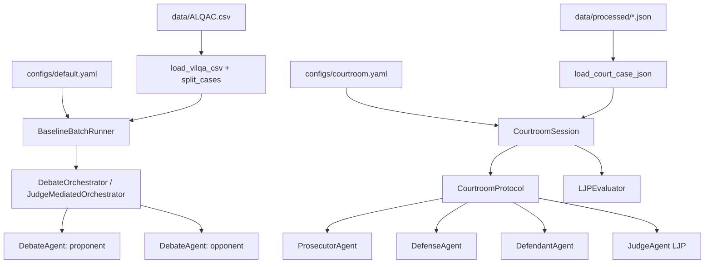

# System Patterns

## Kiến Trúc Hiện Tại
Phase 1 là pipeline **ViLQA/ALQAC legal QA debate**. Phase 3 bổ sung **courtroom LJP simulation** với vai trò pháp lý và protocol 3 giai đoạn, vẫn giữ Phase 1 backward compatible.

## Thành Phần Cốt Lõi
1. **`src/main.py`**: CLI smoke/batch entry point. Đọc `configs/default.yaml`, split dataset, resolve LLM config theo role, và chạy single debate hoặc batch.
2. **`BaselineBatchRunner` (`src/experiment_runner.py`)**: Chạy các method `direct`, `cot`, `vanilla`, `debate`, `both`, `all`, `extractive_qa`, `bm25_reader`; lưu `predictions.csv`, `metrics.json`, `config.json`.
3. **`JudgeMediatedOrchestrator`** (`src/judge_mediated_orchestrator.py`) — **orchestrator mặc định**: judge chọn action tiếp theo (`call_proponent`, `call_opponent`, `ask_question`, `request_closing`, `end_debate`). **`DebateOrchestrator`** (`src/orchestrator.py`): turn order cố định trong Python (legacy ablation).
4. **`DebateAgent` (`src/agents/debate_agent.py`)**: Mỗi lượt gồm private strategy và public argument/rebuttal; có thêm closing statement trước verdict.
5. **`JudgeAgent` (`src/agents/judge_agent.py`)**: Parse belief/verdict JSON, hỗ trợ JSON trong markdown fence, retry 1 lần với LLM thật khi JSON invalid, hỏi follow-up optional, và ghi fallback count.
6. **`src/llm.py`**: Định nghĩa `LLMClient` protocol, `MockLLM`, `OpenAILLM`, `GeminiLLM`, `LocalLLM`, `LLMConfig`, factory theo role. API key đọc từ env, không hard-code.
7. **`src/baselines.py`**: Direct LLM, CoT LLM, Vanilla Debate, optional Hugging Face extractive QA reader, BM25 + reader.
8. **`LegalRetriever` + `reranker.py`**: BM25 rough retrieval, optional semantic rerank (`BAAI/bge-m3`/multilingual models), UTS_VLC legal corpus loader, metadata `article_id`, `law_name`, `source_type`.
9. **`MemoryStore` (`src/memory/memory_store.py`)**: Three-tier memory tách `regulations`, `experiences`, `cases`; mode `off/read_only/read_update`; lexical hoặc embedding retrieval; dedup/limit; reflection prompt optional.
10. **`EvaluatorAgent` (`src/agents/evaluator_agent.py`)**: LLM-as-judge rubric cho Phase 1.
11. **Phase 3 courtroom (`src/courtroom/`)**: `CourtroomProtocol` định nghĩa turn order; `CourtroomSession` điều phối opening → debate → closing → deliberation → ruling.
12. **Phase 3 agents**: `ProsecutorAgent`, `DefenseAgent`, `DefendantAgent`, `BaseLegalAgent`; `JudgeAgent` có thêm LJP methods; `compat.py` alias Phase 1.
13. **`LJPEvaluator` (`src/evaluation/ljp_evaluator.py`)**: charge/article/sentence metrics cho LJP.
14. **`CourtCase` schema (`src/models.py`)**: facts, evidence, testimonies, ground_truth; adapter `to_case_profile()` cho retrieval/memory tái sử dụng.

## Pipeline Phase 1
1. Load `data/ALQAC.csv`.
2. Split train/validation/test theo seed cố định.
3. Fit `LegalRetriever` chỉ từ train cases và optional external legal corpus UTS_VLC để tránh dùng validation/test labels.
4. Chạy selected method trên split được chọn.
5. Evaluate bằng Exact Match và token F1 qua `ViLQAEvaluator`.
6. Ghi artifacts:
   - `predictions.csv`
   - `metrics.json` gồm `metrics_by_method`, `models_by_method`, `fallbacks.fallback_rate`
   - `config.json` đã loại API key
   - optional debate JSON artifacts
   - per-case `evaluations/*.json` gồm automated metrics và optional LLM rubric metrics

## Ablation Matrix P1
- Retrieval: `off`, `bm25_only`, `bm25_rerank`.
- Memory: `off`, `read_only`, `read_update`.
- Debate rounds: `1`, `3`, `5`.
- Judge: `off` qua `vanilla`, `on` qua `debate`.
- Orchestrator: **`judge_mediated` (default)** | `fixed` (legacy ablation repro).
- Roles: Phase 1 `proponent-opponent`; Phase 3 `prosecutor-defense-defendant-judge` qua `CourtroomSession`.
- Script: `scripts/run_ablation_matrix.py` tạo dry-run commands hoặc chạy có `--execute`; docs ở `docs/experiments/p1_ablation_plan.md`.

## Quy Ước Cấu Hình
- `configs/default.yaml` chứa provider/model/temperature riêng cho `direct`, `cot`, `vanilla`, `proponent`, `opponent`, `judge`.
- Env override được hỗ trợ: `LLM_BACKEND`, `LLM_MODEL`, `LLM_TEMPERATURE`, `GEMINI_API_KEY`, `GOOGLE_API_KEY`, `OPENAI_API_KEY`, `LOCAL_LLM_ENDPOINT`, và dạng theo role như `JUDGE_LLM_MODEL`.
- `MockLLM` chỉ dùng cho unit test, CI offline hoặc smoke command có `--llm mock`.

## Phase 3 Courtroom LJP (đã scaffold)
- Protocol 3 giai đoạn: Opening (judge → prosecutor → defendant → defense) → Debate (n rounds) → Judgment (closing → deliberation → ruling).
- Config: `configs/courtroom.yaml` — max rounds, phase on/off, prompt limits.
- Pilot case: `data/processed/case_01_theft.json`.
- CLI: `python -m src.main --run-courtroom --llm mock`.
- Dataset candidates: SimuCourt (`load_simucourt`), VLegal-Bench (`load_vlegal`), CAIL2018, congbobanan (planned).
